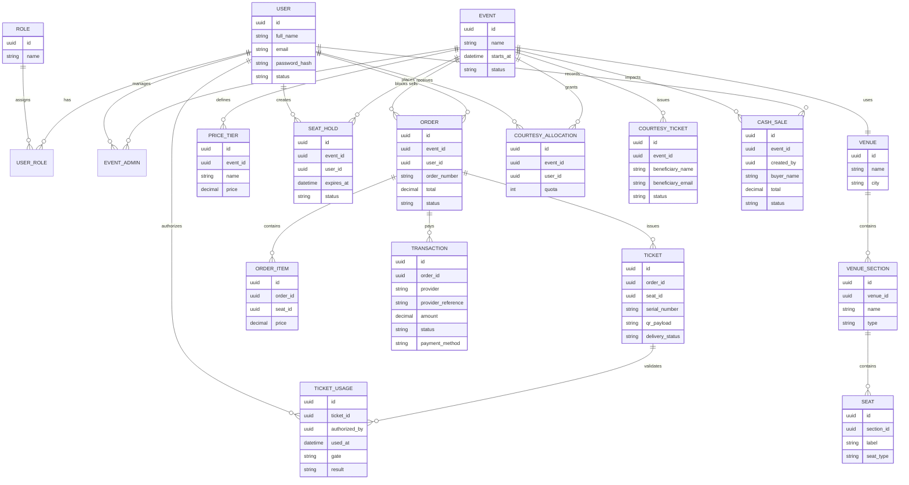

# Validacion de Requisitos

## Estado General

- Cumple bien la base frontend del cliente: autenticacion, listado, detalle, mapa visual, carrito, historial y dashboard personal.
- No cumple aun el alcance transaccional y operativo completo: pagos reales, reserva temporal de 5 minutos, PDF, QR validable, email, roles administrativos, control de acceso, cortesias y ventas en efectivo.

## Checklist de Cumplimiento

| Requisito | Estado | Nota |
|---|---|---|
| Listado de eventos activos | Cumple | Catalogo y filtros implementados |
| Detalle de evento | Cumple | Informacion y precios por localidad |
| Mapa interactivo del recinto | Parcial | Visual e interactivo, pero mock |
| Seleccion de asiento en tiempo real | No cumple | Sin websocket/polling ni bloqueo server-side |
| Reserva temporal por 5 minutos | No cumple | No existe TTL de hold |
| Liberacion automatica por timeout | No cumple | No existe expiracion automatica |
| Confirmacion de compra por pasarela | No cumple | No hay gateway real |
| Registro formal del pago | Parcial | Solo se guarda `paymentMethod` |
| Generacion de PDF | No cumple | Se descarga `.txt`, no PDF |
| QR unico validable | Parcial | Solo existe string `qrCode` |
| Envio por correo | No cumple | No hay servicio de email |
| Comprobante/factura | No cumple | No existe flujo fiscal |
| Registro y autenticacion de cliente | Cumple | Login, registro, recuperacion |
| Consulta de eventos activos | Cumple | Listado y home |
| Compra de entradas | Parcial | Demo funcional, no transaccion real |
| Seleccion de asiento | Parcial | Correcta a nivel UI |
| Descarga y consulta de tickets | Parcial | Descarga simple, no ticket formal |
| CRUD de eventos admin | No cumple | No existe modulo administrativo |
| Configuracion de localidades/precios/mapa | No cumple | No existe backoffice |
| Graficos de ventas por dia | No cumple | No implementado |
| Reporte de ingresos por metodo de pago | No cumple | No implementado |
| Estadisticas del evento | No cumple | Dashboard actual es de cliente |
| Control de acceso con lector QR | No cumple | No existe scanner ni validacion |
| Registro de autorizadores | No cumple | No hay rol ni modulo |
| Bloqueo de reutilizacion de QR | No cumple | No implementado |
| Registro de fecha/hora de ingreso | No cumple | No implementado |
| Gestion de cortesias | No cumple | No implementado |
| Ventas en efectivo | No cumple | No implementado |
| Super Administrador | No cumple | No hay roles ni permisos |
| Administrador | No cumple | No hay roles ni permisos |
| Autorizador | No cumple | No hay roles ni permisos |
| Cliente | Parcial alto | La experiencia base existe |
| Diagrama entidad relacion | No cumple | No esta documentado en repo |

## Modulos Actuales del Frontend

- `auth`: login, registro, recuperacion de password
- `events`: home, listado, detalle
- `booking`: mapa de asientos, carrito, confirmacion, historial
- `dashboard`: overview, tickets, compras, perfil
- `core`: guards, interceptors, servicios HTTP, JWT, loader, errores globales

## Modulos Faltantes

### Frontend

- `admin-events`
  - CRUD de eventos
  - configuracion de precios, localidades, mapa y cupos
- `admin-reports`
  - ventas por dia
  - ingresos por metodo de pago
  - estado operativo del evento
- `admin-access`
  - lector QR
  - validacion de entrada
  - registro de ingreso
- `admin-courtesies`
  - asignacion de cupo por proveedor
  - emision de cortesia
- `admin-cash-sales`
  - venta manual
  - descarga inmediata del ticket
- `admin-users`
  - super admin
  - administradores
  - autorizadores
- `checkout-payment`
  - formulario de pago real
  - estados de transaccion

### Backend / API

- `auth`
  - login, refresh token, roles, permisos
- `events`
  - CRUD, asignacion de admins, venue map
- `seat-holds`
  - bloqueo temporal, renovacion y expiracion
- `payments`
  - payment intent, confirmacion, webhooks
- `orders`
  - confirmacion de compra, items, impuestos
- `tickets`
  - PDF, QR, reenvio por email
- `access-control`
  - validacion QR, uso unico, registro de acceso
- `courtesies`
  - cupos, emision y trazabilidad
- `cash-sales`
  - registro manual y afectacion estadistica
- `reports`
  - dashboards y exportes

## ERD Propuesto

## Flujo Objetivo de Compra

1. Cliente entra al evento.
2. Consulta disponibilidad real.
3. Selecciona asientos.
4. Backend crea `seat hold` por 5 minutos.
5. Frontend muestra countdown.
6. Cliente inicia pago.
7. Pasarela autoriza o rechaza.
8. Si paga:
   - se confirma `order`
   - se genera `ticket`
   - se genera PDF
   - se genera QR unico
   - se envia email
9. Si falla o expira:
   - se libera el `seat hold`
   - los asientos vuelven a disponible

## Prioridad Recomendada

### Fase 1

- roles y permisos
- seat hold de 5 minutos
- checkout con pasarela real
- ordenes y transacciones

### Fase 2

- ticket PDF + QR real
- envio de correo
- dashboard administrativo de eventos

### Fase 3

- control de acceso con QR
- cortesias
- ventas en efectivo
- reportes financieros y operativos

## Conclusion

El proyecto actual sirve como base frontend moderna y reutilizable, pero todavia no cubre el alcance completo del negocio. La brecha principal esta en:

- transaccionalidad real
- backoffice administrativo
- control de acceso
- trazabilidad completa de tickets
